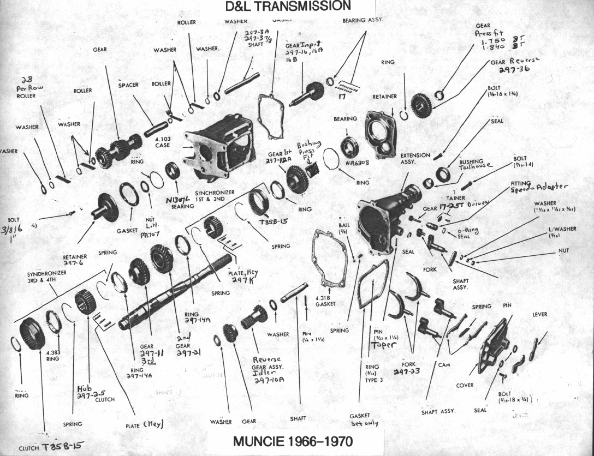
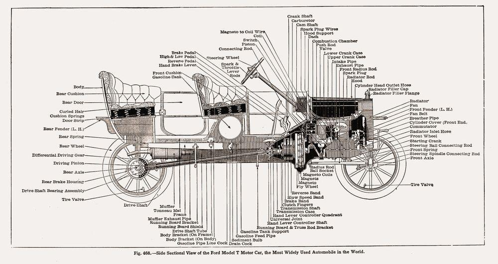
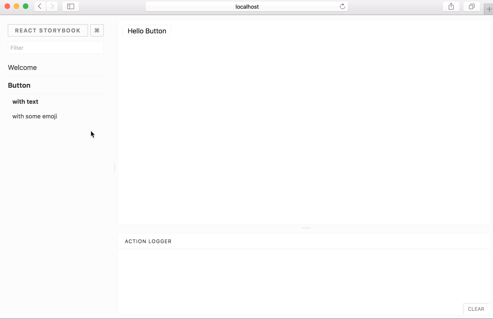
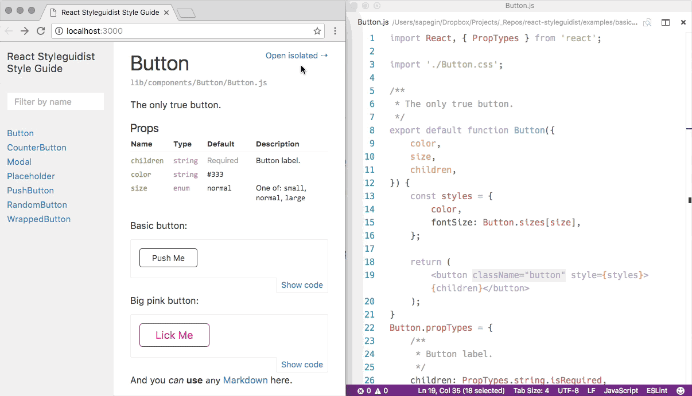
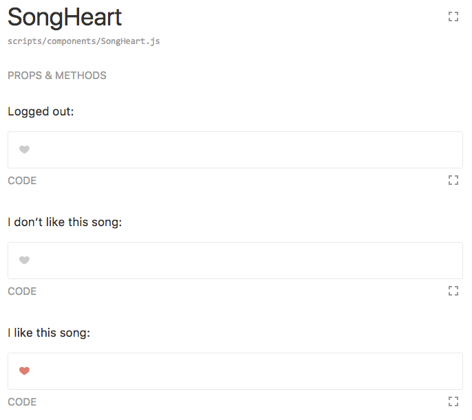
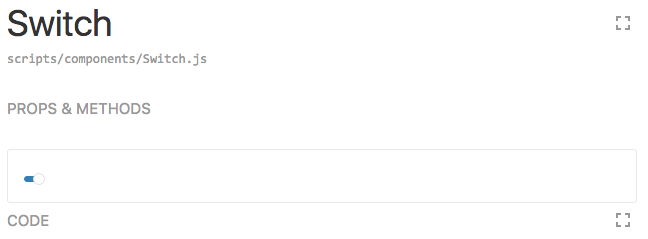
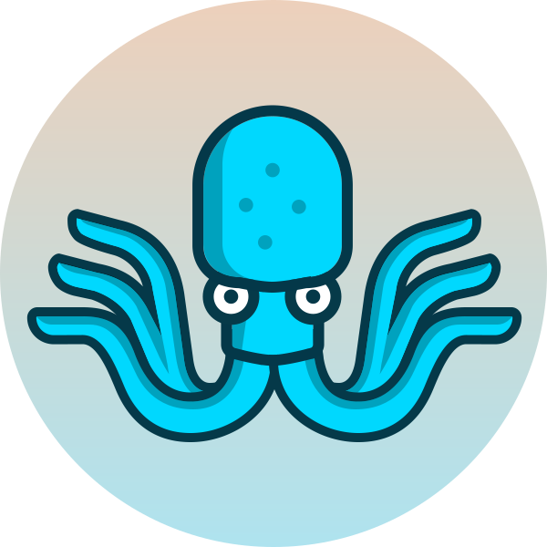

title: Component-driven development with React
author:
  name: Artem Sapegin
  twitter: iamsapegin
  url: http://sapegin.me
style: styles.css
output: cdd.html

--

# Component-driven development with React

--

### Traditional development workflow

1. Change the code
2. Refresh the app in the browser
3. Click-click-click to reproduce the desired state
4. Go to step 1

--

### In React we have components



--

### We can develop components in isolation


--

### And compose the UI from them



-- teal

# Component-driven development

## Or style guide driven development

--

### Benefits

* One component at a time
* Better team communication
* Easier work parallelization
* Faster feedback loop
* Promotes reuse and composition
* Easier to test without real data
* Style guide and documentation for free

--

### Problems

* Learning a new tool and approach
* Extra work

-- teal

# Tools

--

### [React Storybook](https://storybook.js.org/)



--

### Stories

```js
import React from 'react';
import { storiesOf } from '@storybook/react';
import { action } from '@storybook/addon-actions';
import Button from '../components/Button';

storiesOf('Button', module)
  .add('default', () => (
    <Button onClick={action('clicked')}>Push Me</Button>
  ))
  .add('large size', () => (
    <Button size="large">Push Me</Button>
  ));
```

--

### [React Styleguidist](https://react-styleguidist.js.org/)



--

### Markdown examples

```markdown
React button component example:

    <Button onClick={() => console.log('clicked')>Push Me</Button>

Large size:

    <Button size="large">Push Me</Button>
```

-- teal

# React Styleguidist

--

### Setting up Styleguidist

1. `npm i -D react-styleguidist webpack`
2. Add `styleguide.config.js`:

   ```js
   module.exports = {
     components: 'src/components/**/[A-Z]*.js'
   };
   ```

3. Add scripts to `package.json`:

   ```json
   {
     "scripts": {
       "styleguide": "styleguidist server",
       "styleguide:build": "styleguidist build"
     }
   }
   ```

4. Run `npm run styleguide`

--

### The new development workflow

1. Run a style guide server: `npm run styleguide`
2. Create a new component
3. Create an example file: `Readme.md` or `ComponentName.md`
4. Add some examples to this Markdown file
5. Open your component in isolated mode in Styleguidist
6. Start making changes to your component

-- teal

# Documenting components

--

### PropTypes

```js
const propTypes = {
  authed: PropTypes.shape({
    user: PropTypes.object,
  }).isRequired,
  className: PropTypes.string,
  dispatch: PropTypes.func.isRequired,
  /** Is the user liked the song */
  isLiked: PropTypes.bool,
  /** SoundCloud song ID */
  songId: PropTypes.number,
};
```

--

### PropTypes


--

### Markdown examples

```
Logged out:

    <SongHeart authed={{}} dispatch={console.log} />

I don’t like this song:

    <SongHeart authed={{user: {}}} dispatch={console.log} />

I like this song:

    <SongHeart authed={{user: {}}} dispatch={() => {}} isLiked />
```

--

### Markdown examples



--

### Controlled components

```js
initialState = { on: false };
<Switch
  isOn={state.on}
  toggleFunc={() => setState({ on: !state.on })}
/>
```

--

### Controlled components



-- image


