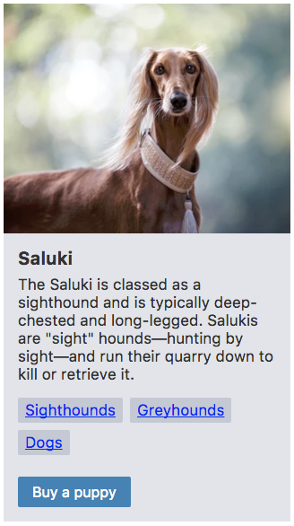

export { theme } from './theme'

import { Head, Image, Split, SplitWithHeading, Primary, Secondary } from './theme'

<Head>
  <title>Custom CSS is the path to inconsistent UI by Artem Sapegin</title>
</Head>

export default Primary

# Custom CSS is the path to inconsistent UI

---
export default Secondary

# What’s the issue?

---

<Image src="./public/images/inconsistent-styles/doors.jpg" alt="Inconsistency in the UI" />

---

http://wow.sapegin.me/6d959cd6b79f/Image%202018-09-21%20at%2010.37.05%20PM.png

---

## Sources of custom CSS

- Typography
- Whitespace

---
export default SplitWithHeading

## Custom CSS

```css
.description {
  margin-bottom: 20px;
  font-size: 16px;
}
```

```css
.count {
  margin-left: 0.75em;
  font-size: 14px;
  opacity: 0.5;
}
```

---

😭

---
export default Primary

How can we fix that?

---
export default Primary

## Design tokens

---

https://marvelapp.com/styleguide/design/color-scheme
https://pricelinelabs.github.io/design-system/color/
https://polaris.shopify.com/design/colors#section-color-palette

---

https://cloudflare.github.io/cf-ui/#cf-design-gradients


---

https://vueds.com/example/#!/Design%20Tokens (font sizes)

---

https://design-system.pluralsight.com/core/spacing/

---

https://www.lightningdesignsystem.com/design-tokens/

---
export default SplitWithHeading

## Custom CSS

```scss
.description {
  margin-bottom: $spacing--3;
  font-size: $fontSize--base;
}
```

```scss
.count {
  margin-left: $spacing--2;
  font-size: $fontSize--small;
  color: $color--light;
}
```

---

😐

---
export default Primary

# Components

---

## Typography


---

## `Text` and `Heading`

---

## `Text`

---

https://polaris.shopify.com/components/titles-and-text/text-style

---

http://mineral-ui.com/components/text

---

## Styles

* Normal text
* Secondary text (light color)
* Error (red color)

---

# Find minimal number of styles to cover most of the use cases of your app or site

---

## What else?

* Custom HTML element
* Alignment (left, center)
* Whitespace (margin)
* Truncation (with …)

---

## API: Selecting a style

* `<Text secondary>` ;-)
* `<Text error>` ;-)
* `<Text secondary error>` ;-(

---

## API: Selecting a style

* `<Text variant="secondary">` ;-)
* `<Text variant="error">` ;-)

---

# Make impossible states impossible

---

## API: Selecting a style

* `<Text color="gray" size="small">` ;-(
* `<Text variant="secondary">` ;-)

---

## API: Custom HTML element

* `<Text>` → `<p>` ;-(
* `<Text inline>` → `<span>` ;-(
* `<Text is="span">` → `<span>` ;-)
* `<Text is="header">` → `<header>` ;-)

---

## `Heading`

---

https://vueds.com/example/#!/Elements?id=heading

---

## API: Selecting size / heading level

* `<Heading level={1}>` ;-)
* `<Heading level={2}>` ;-)
* `<Heading level={3} is="h2">` ;-)

---

```html
<Heading level={1}>Saluki</Heading>
<Text>
  The Saluki is classed as a sighthound
  and is typically deep-chested and long-legged.
  Salukis are “sight” hounds—hunting by sight—and
  run their quarry down to kill or retrieve it.
</Text>
<Text variant="secondary">Don’t leave any food on a
  table when saluki is around.</Text>
```

---

😀

---


## Whitespace

- Paddings inside components
- Glue components together

---

## Spacing scales

http://wow.sapegin.me/a17c3f2bce59/Image%202018-09-21%20at%2010.34.49%20PM.png

---

-----------------------------------------------------------------

TODO


## [Nathan Curtis’ framework](https://medium.com/eightshapes-llc/space-in-design-systems-188bcbae0d62)


---

## [React Spaceman](https://github.com/sapegin/react-spaceman)

- 8px grid
- `xxs` (2px) to `xxl` (128px)
- geometric progression

&nbsp;

[github.com/sapegin/react-spaceman](https://github.com/sapegin/react-spaceman)

---

## React Spaceman

```html
<Panel
  below="xxs|xs|s|m|l|xl|xxl"
  inset="xxs|xs|s|m|l|xl|xxl"
  x="xxs|xs|s|m|l|xl|xxl"
  y="xxs|xs|s|m|l|xl|xxl"
  between="xxs|xs|s|m|l|xl|xxl"
  squish
  inline
>...</Panel>
```

---

## Space inside components

```js
import Panel from 'react-spaceman';
const Button = props => (
  <Panel
    inset="m"
    squish
    tag="button"
    className={classes.root}
    tagProps={props}
  >
    {props.children}
  </Panel>
);
```

---

## Glue components together



---

## Glue components together

```html
<Panel inset="m" between="m">
  <Panel between="s">
    <h3>Saluki</h3>
    <div>The Saluki is classed as a…</div>
  </Panel>
  <Panel between="s" inline>
    <Tag href="/sighthounds">Sighthounds</Tag>
    <Tag href="/dogs">Dogs</Tag>
  </Panel>
  <Button>Buy a puppy</Button>
</Panel>
```

---

## Components

- Limited freedom → consistency
- Avoid custom CSS for many components
- Easier code reviews
- Easier to document
- TypeScript and Flow

---
export default Primary

# Consistent by default<br/>Custom when required by&nbsp;design, not&nbsp;randomly custom

---

## Thank you and use components

Slides: [bit.ly/consistent-css](https://sapegin.github.io/slides/inconsistent-styles)<br/> Me: [sapegin.me](http://sapegin.me/)<br/> Twitter: [@iamsapegin](https://twitter.com/iamsapegin)<br/> GitHub: [sapegin](https://github.com/sapegin)


---

## Image credits

- [Max Stoiber](https://mxstbr.com/)
- [Priyanka Godbole](https://blog.prototypr.io/10-practical-steps-to-create-a-predictable-accessible-and-harmonious-typography-system-a-case-6c85d901bedd)
- [Nathan Curtis](https://medium.com/eightshapes-llc/space-in-design-systems-188bcbae0d62)

-----------------------------------------------------

---

## Naming scales ?

* x-small small medium large x-large
* xs s m l xl
* alpha beta gamma delta epsilon

