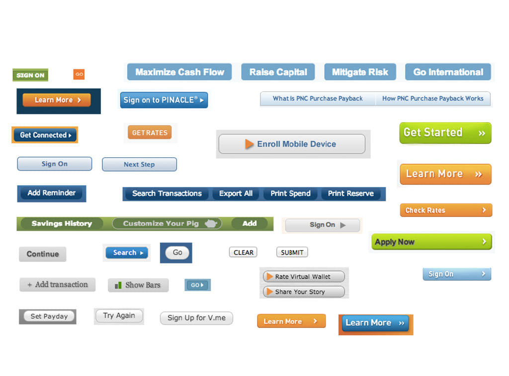

export { theme } from './theme'

import { Head, Image, Split, SplitWithHeading, Primary, Secondary, Bar } from './theme'

import Stack from 'stack-styled'

<Head>
  <title>Custom CSS is the path to inconsistent UI by Artem Sapegin</title>
</Head>

export default Primary

# Custom CSS is the path to inconsistent UI

---
export default Secondary

# What’s the issue?

---



---


---

<Image src="./images/inconsistent-styles-full/doors.jpg" alt="Inconsistency in the UI" />

---
export default SplitWithHeading

## Custom CSS

```css
.description {
  margin-bottom: 20px;
  font-size: 16px;
}
```

```css
.count {
  margin-left: 0.75em;
  font-size: 14px;
  opacity: 0.5;
}
```

---

😭

---

# CSS is too powerful

---
export default Secondary

# How can we fix that?

---
export default Primary

# Design tokens

---

https://marvelapp.com/styleguide/design/color-scheme
https://pricelinelabs.github.io/design-system/color/
https://polaris.shopify.com/design/colors#section-color-palette

---

https://cloudflare.github.io/cf-ui/#cf-design-gradients

---

https://vueds.com/example/#!/Design%20Tokens (font sizes)

---

https://design-system.pluralsight.com/core/spacing/

---

https://www.lightningdesignsystem.com/design-tokens/

---
export default SplitWithHeading

## Custom CSS with design tokens

```css
.description {
  margin-bottom: var(--spacing--3);
  font-size: var(--fontSize--base);
}
```

```css
.count {
  margin-left: var(--spacing--2);
  font-size: var(--fontSize--small);
  color: var(--color--light);
}
```

---

😐

---

# Not all token combinations are good

---

```css
.cantreadthis {
  font-size: var(--fontSize--x-small);
  color: var(--color--light);
  opacity: 0.5;
}
```

---
export default Secondary

# Can we do better?

---

# YES!

---

# Stop writing CSS!

---
export default Primary

# Primitive components

---

## Sources of custom CSS

- Typography
- Whitespace
- Layout

---
export default Secondary

## Typography

---
export default Secondary

# `Text`

---

https://polaris.shopify.com/components/titles-and-text/text-style

---

http://mineral-ui.com/components/text

---

## Styles

* Normal text
* Secondary text (light color)
* Error (red color)

---

# Find minimal number of styles to cover most of the use cases of your app or site

---

## What else?

* Custom HTML element
* Alignment (left, center)
* Whitespace (margin)
* Truncation (with …)

---

## API: Selecting a style

* `<Text secondary>` ;-)
* `<Text error>` ;-)
* `<Text secondary error>` ;-(

---

## API: Selecting a style

* `<Text variant="secondary">` ;-)
* `<Text variant="error">` ;-)

---

# Make impossible states impossible

---

## API: Selecting a style

* `<Text color="gray" size="small">` ;-(
* `<Text variant="secondary">` ;-)

---

## API: Custom HTML element

* `<Text>` → `<p>` ;-(
* `<Text inline>` → `<span>` ;-(
* `<Text is="span">` → `<span>` ;-)
* `<Text is="header">` → `<header>` ;-)

---
export default Secondary

## `Heading`

---

https://vueds.com/example/#!/Elements?id=heading

---

## API: Selecting size / heading level

* `<Heading level={1}>` ;-)
* `<Heading level={2}>` ;-)
* `<Heading level={3} is="h2">` ;-)

---

```jsx
<Heading level={1}>Saluki</Heading>
<Text>
  The Saluki is classed as a sighthound
  and is typically deep-chested and long-legged.
  Salukis are “sight” hounds—hunting by sight—and
  run their quarry down to kill or retrieve it.
</Text>
<Text variant="secondary">Don’t leave any food on a
  table when saluki is around.</Text>
```

---

😀

---
export default Secondary

## Whitespace

---
export default SplitWithHeading

## Spacing scales

<React.Fragment>
  <h3>Linear progression</h3>
  <Stack gap={2}>
    <Bar width="12.5%">4px</Bar>
    <Bar width="25%">8px</Bar>
    <Bar width="37.5%">12px</Bar>
    <Bar width="50%">16px</Bar>
    <Bar width="62.5%">20px</Bar>
    <Bar width="75%">24px</Bar>
    <Bar width="87.5%">28px</Bar>
    <Bar width="100%">32px</Bar>
  </Stack>
</React.Fragment>

<React.Fragment>
  <h3>Geometric progression</h3>
  <Stack gap={2}>
    <Bar width="3.125%">2px</Bar>
    <Bar width="6.25%">4px</Bar>
    <Bar width="12.5%">8px</Bar>
    <Bar width="25%">16px</Bar>
    <Bar width="50%">32px</Bar>
    <Bar width="100%">64px</Bar>
  </Stack>
</React.Fragment>

---

## Scale naming

* x-small small medium large x-large
* xs s m l xl
* alpha beta gamma delta epsilon
* 1, 2, 3, 4 5

---

```js
const space = {
  xxs: '2px',
  xs: '4px',
  s: '8px',
  m: '16px',
  l: '32px',
  xl: '64px',
  xxl: '128px'
};
```

---

```js
const space = {
  xxs: '0.125rem',
  xs: '0.25rem',
  s: '0.5rem',
  m: '1rem',
  l: '2rem',
  xl: '3rem',
  xxl: '4rem'
};
```

---

## Paddings

```jsx
<Box
  p="xl"
  pt="xl"
  pr="xl"
  pb="xl"
  pl="xl"
  px="xl"
  py="xl"
/>
```

---

## Paddings

```jsx
const Button = props => (
  <Box is="button" px="m" py="s" {...props} />
);
```

---

## Margins

```jsx
<Box
  m="xl"
  mt="xl"
  mr="xl"
  mb="xl"
  ml="xl"
  mx="xl"
  my="xl"
/>
```

---

## Margins

```jsx
<Box mb="xl">
  <Box mb="l">
    <Heading level={1}>Saluki</Heading>
  </Box>
  <Text>The Saluki is classed as a sighthound...</Text>
</Box>
```

---

## Flexbox layouts

```jsx
<Flex
  alignItems="center"
  justifyContent="center"
  flexDirection="row"
  flexWrap="wrap"
  // ...
/>
```

---

## Flexbox layouts

```jsx
<Flex>
  <Box flex={1}>
    <Input
      type="email"
      value=""
      required
      placeholder="Email"
      aria-label="Email"
    />
  </Box>
  <Box pl="m">
    <Button variant="primary" type="submit">
      Subscribe
    </Button>
  </Box>
</Flex>
```

---

## Responsive layouts

```jsx
<Box width={[ 1, 1/2, 1/4 ]} />
```

---

## Responsive layouts

TODO

---

## CSS Grid layouts

```jsx
<Stack
  gap="m"
  gridColumn=""
  gridRow=""
  gridAutoFlow=""
  gridAutoRows=""
  // ...
/>
```

---

## CSS Grid layouts

```jsx
<Stack gap="m" minWidth={200}>
  
  
  
  {/* .... */}
</Stack>
```

---

## Example

```jsx
<Stack gridTemplateColumns="minmax(16px, 1fr) minmax(auto, 57ch) minmax(16px, 1fr)">
  <Stack gridColumn="1/4">
    
  </Stack>
  <Stack gridColumn="2">
    <Heading level={1}>Down the Rabbit Hole</Heading>
    <Text>Alice was beginning to get very tired of sitting by her sister on the
    bank, and of having nothing to do: once or twice she had peeped into the book
    her sister was reading, but it had no pictures or conversations in it,
    “and what is the use of a book,” thought Alice “without pictures or
    conversation?”</Text>
    {/* .... */}
  </Stack>
</Stack>
```

---

## Components

- Limited freedom → consistency
- Discoverable API
- Faster development
- Readable code
- Easier code reviews
- Easier to document
- TypeScript and Flow
- Built-in accessibility

---
export default Secondary

# Consistent by default<br/>Custom when required by&nbsp;design, not&nbsp;randomly custom

---

## Tools

* [Text](https://github.com/component-driven/component-driven-development/tree/master/src/components/core/Text)
* [Heading](https://github.com/component-driven/component-driven-development/tree/master/src/components/core/Heading)
* [styled-system](https://jxnblk.com/styled-system/)
* [Rebass Grid](https://rebassjs.org/grid)
* [Stack Styled](https://sapegin.github.io/stack-styled/)

---

## Thank you and use components

Slides: [bit.ly/consistent-css](https://sapegin.github.io/slides/inconsistent-styles)<br/> Me: [sapegin.me](http://sapegin.me/)<br/> Twitter: [@iamsapegin](https://twitter.com/iamsapegin)<br/> GitHub: [sapegin](https://github.com/sapegin)


---

## Image credits

- [Max Stoiber](https://mxstbr.com/)
- [Priyanka Godbole](https://blog.prototypr.io/10-practical-steps-to-create-a-predictable-accessible-and-harmonious-typography-system-a-case-6c85d901bedd)
- [Nathan Curtis](https://medium.com/eightshapes-llc/space-in-design-systems-188bcbae0d62)
- [Brad Frost](http://bradfrost.com/blog/post/interface-inventory/)
