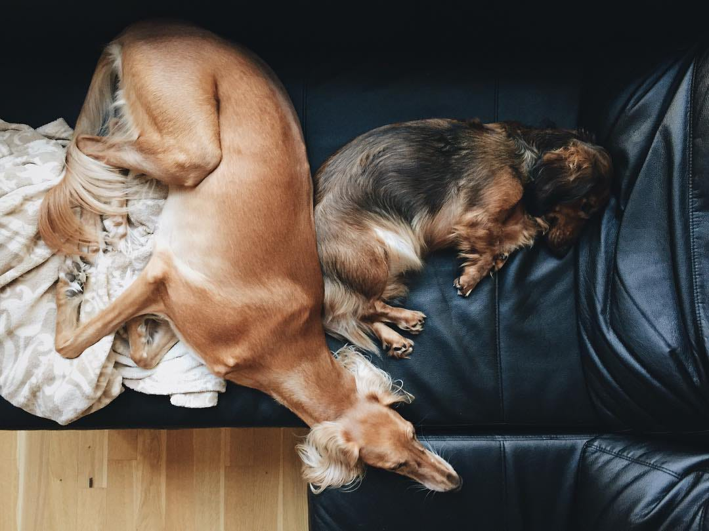

title: Custom CSS is the path to inconsistent UI by Artem Sapegin
style: styles.css
output: public/inconsistent-styles.html

-- cover


-- cover


-- teal

## What’s the issue?

-- cover


--

### Sources of custom CSS

* Typography
* Whitespace

-- split

### Custom CSS

```css
.description {
  margin-bottom: 20px;
  font-size: 16px;
}
```

```css
.count {
  margin-left: 0.75em;
  font-size: 14px;
  opacity: 0.5;
}
```

-- orange

# Why not variables?

--

Variables can help with consistency

--

### But

* More writing and thinking
* Hard to ensure correct usage
* May be hard to update

-- teal

# What’s the solution?

-- orange

# Components

--

### Typography


--

### &lt;Text>

```html
<div>
  <Header level={2}>Saluki</Header>
  <Text>
    The Saluki is classed as a sighthound
    and is typically deep-chested and long-legged.
    Salukis are “sight” hounds—hunting by sight—and
    run their quarry down to kill or retrieve it.
  </Text>
  <Text small>Don’t leave any food on a
    table when saluki is around.</Text>
</div>
```

--

### Whitespace

* Paddings inside components
* Glue components together

--

### [Nathan Curtis’ framework](https://medium.com/eightshapes-llc/space-in-design-systems-188bcbae0d62)


--

### [React Spaceman](https://github.com/sapegin/react-spaceman)

* 8px grid
* `xxs` (2px) to `xxl` (128px)
* geometric progression

&nbsp;

[github.com/sapegin/react-spaceman](https://github.com/sapegin/react-spaceman)

--

### React Spaceman

```html
<Panel
  below="xxs|xs|s|m|l|xl|xxl"
  inset="xxs|xs|s|m|l|xl|xxl"
  x="xxs|xs|s|m|l|xl|xxl"
  y="xxs|xs|s|m|l|xl|xxl"
  between="xxs|xs|s|m|l|xl|xxl"
  squish
  inline
>...</Panel>
```

--

### Space inside components

```js
import Panel from 'react-spaceman'
const Button = props => (
  <Panel
    inset="m"
    squish
    tag="button"
    className={classes.root}
    tagProps={props}
  >
    {props.children}
  </Panel>
)
```

--

### Glue components together


--

### Glue components together

```html
<Panel inset="m" between="m">
  <Panel between="s">
    <h3>Saluki</h3>
    <div>The Saluki is classed as a…</div>
  </Panel>
  <Panel between="s" inline>
    <Tag href="/sighthounds">Sighthounds</Tag>
    <Tag href="/dogs">Dogs</Tag>
  </Panel>
  <Button>Buy a puppy</Button>
</Panel>
```

--

### Components

* Limited freedom → consistency
* Avoid custom CSS for many components
* Easier code reviews
* Easier to document
* TypeScript and Flow

-- orange

## Consistent by default<br>Custom when required by&nbsp;design, not&nbsp;randomly custom

--

### Thank you and use components

Slides: [bit.ly/consistent-css](https://sapegin.github.io/slides/inconsistent-styles)<br>
Me: [sapegin.me](http://sapegin.me/)<br>
Twitter: [@iamsapegin](https://twitter.com/iamsapegin)<br>
GitHub: [sapegin](https://github.com/sapegin)



--

### Image credits

* [Max Stoiber](https://mxstbr.com/)
* [Priyanka Godbole](https://blog.prototypr.io/10-practical-steps-to-create-a-predictable-accessible-and-harmonious-typography-system-a-case-6c85d901bedd)
* [Nathan Curtis](https://medium.com/eightshapes-llc/space-in-design-systems-188bcbae0d62)
