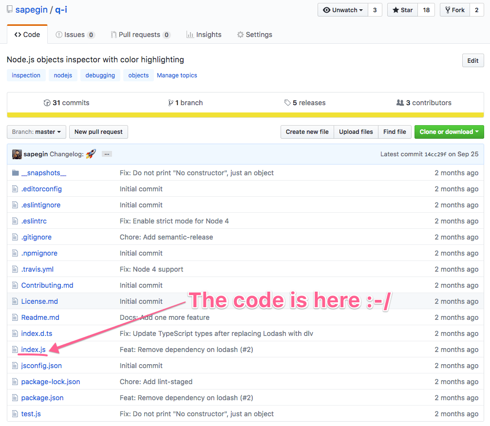
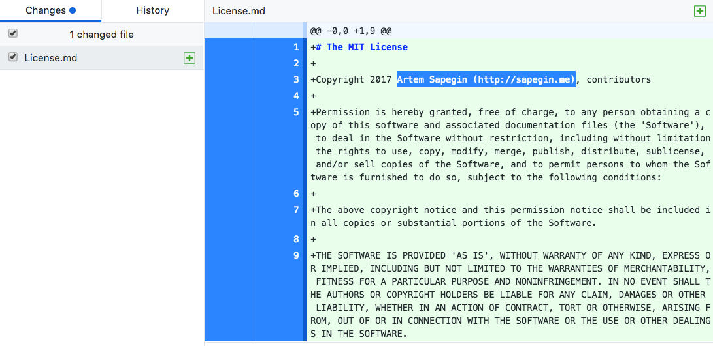
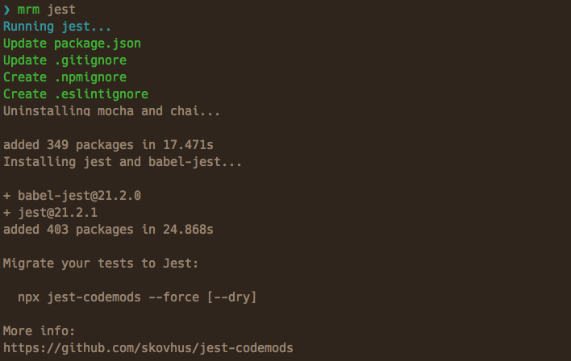
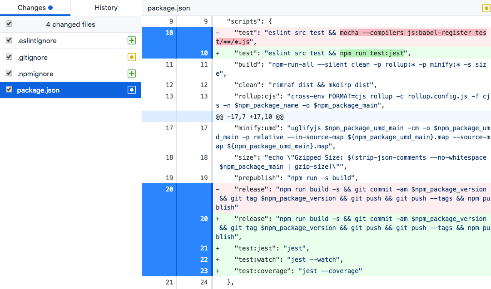

title: Automating open source project configuration with Mrm by Artem Sapegin
style: styles.css
output: public/mrm.html

-- cover

# Automating open source project configuration with Mrm

## Artem Sapegin

--

### Typical open source project



--

* 1 × source code file
* 1 × test file
* 1 × documentation file
* 11 × support files

-- teal

# `.somethingrc`

-- small center

`.babelignore .babelrc .editorconfig .eslintignore .eslintrc .flowconfig .gitattributes .gitignore .istanbul.yml .npmignore .nvmrc .prettierignore .prettierrc .proselintrc .remarkrc .shipit .stylelintrc .textlintrc .travis.yml appveyor.yml Changelog.md Code_of_Conduct.md codecov.yml Contributing.md Issue_Template.md jsconfig.json lerna.json License.md open-bot.yaml package.json Pull_Request_Template.md Readme.md tsconfig.json`

--

<video src="images/mrm/nooooo.mp4" autoplay loop></video>

--

## × number of your projects

--

<video src="images/mrm/hamster.mp4" autoplay loop></video>

--

## Support files are _slightly different_ in different projects

--

<video src="images/mrm/puppies.mp4" autoplay loop></video>

--

## Templates are OK for bootstrapping new projects

--

## Updates are hard

--

## We need codemods for config files

-- orange

# Mrm

## [github.com/sapegin/mrm](https://github.com/sapegin/mrm)

-- teal

# Example: gitignore task

--

```
npx mrm gitignore
```

--


-- teal

# Example: license task

--

```bash
npx mrm license
```

--



-- teal

# Example: Jest task

--

```
npx mrm jest
```

--

* Adds npm scripts
* Config in `package.json`
* `.gitignore`, `.npmignore`, `.eslintignore`
* Installs Jest
* babel-jest, ts-jest, Enzyme if needed
* Removes Mocha and AVA
* And more

--



--



-- orange

# Details

--

### Default tasks

CodeCov, EditorConfig, ESLint, Jest, lint-staged, Prettier, semantic-release, React Styleguidist, stylelint, Travis CI, TypeScript, package.json, contributing guidelines, license and readme files

--

### Minimal configuration

* Infer configuration from the project itself or from the environment

--

### Minimal changes

* Infer indentation style or read from EditorConfig
* Keep comments in JSON

--

### Configuration

* Command line:

  ```
  npx mrm license --config:licenseFile README
  ```

* Config file:

  * `~/.mrm/config.json`
  * `~/dotfiles/mrm/config.json`

--

### Sharing tasks

* `mrm-task-<TASK>`
* `mrm-preset-<PRESET>`

-- orange

# Writing custom tasks

--

### API for writing tasks — `mrm-core`

* JSON, YAML, INI, new line separated text files
* npm install / uninstall
* File operations
* EditorConfig utilities

--

### Simplest task

```js
const { lines } = require('mrm-core');
module.exports = () => {
  // Read .gitignore if it exists
  lines('.gitignore')
    // Add lines that do not exist in a file yet,
    // but keep all existing lines
    .add(['node_modules/', '.DS_Store'])
    // Update or create a file
    .save();
};
```

--

### Configurable task

```js
module.exports = config => {
  // npm mrm eslint --config:eslintPreset airbnb
  const { indent, eslintPreset } = config
    .defaults({
      // Default value
      eslintPreset: 'eslint:recommended'
    })
    // Required option
    .require('indent')
    .values();
  /* _ */
};
```

--

### JSON files

```js
const { json } = require('mrm-core');
module.exports = config => {
  // Read .eslintrc if it exists
  json('.eslintrc')
    // Merge content with new options
    .merge({
      parser: 'babel-eslint',
      extends: 'eslint:recommended'
    })
    .save();
};
```

--

### `package.json` files

```js
const { packageJson } = require('mrm-core');
module.exports = config => {
  // Read project’s package.json
  packageJson()
    // Add lint script
    .setScript('lint', 'eslint . --cache --fix')
    // Add pretest script
    .prependScript('pretest', 'npm run lint')
    .save();
};
```

--

### npm dependencies

```js
const { packageJson, install } = require('mrm-core');
module.exports = config => {
  const packages = ['eslint'];
  const pkg = packageJson();
  if (pkg.get('devDependencies.babel-core')) {
    packages.push('babel-eslint');
  }
  // Install npm dependencies
  install(packages);
};
```

--

# And much more

[github.com/sapegin/mrm-core](https://github.com/sapegin/mrm-core)

--

<video src="images/mrm/happy.mp4" autoplay loop></video>

--

### Thank you and automate your configs

Mrm: [github.com/sapegin/mrm](https://github.com/sapegin/mrm)<br>
Slides: [bit.ly/mrm-slides](https://sapegin.github.io/slides/mrm)<br>
Me: [sapegin.me](http://sapegin.me/)<br>
Twitter: [@iamsapegin](https://twitter.com/iamsapegin)<br>
GitHub: [sapegin](https://github.com/sapegin)


